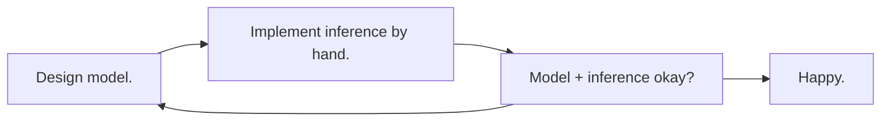
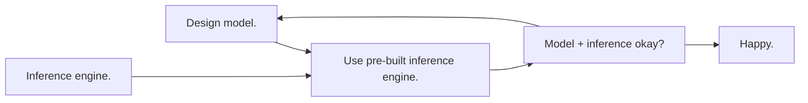

# Overview

**GenJAX: a probabilistic programming library designed from the ground up to scale Bayesian modeling and inference into high performance settings.** (1)
{ .annotate }

1.  Here, _high performance_ means massively parallel, either cores or devices.

    For those whom this overview page may be irrelevant: we're talking about putting expressive models and customizable Bayesian inference on GPUs, TPUs, etc - without sacrificing abstraction or modularity.

---

[**Gen**][gen] is a multi-paradigm (generative, differentiable, incremental) system for probabilistic programming. **GenJAX** is an implementation of Gen on top of [**JAX**][jax] - exposing the ability to programmatically construct and manipulate **generative functions** (1) (computational objects which represent probability measures over structured sample spaces), with compilation to native devices, accelerators, and other parallel fabrics. 
{ .annotate }

1.  By design, generative functions expose a concise interface for expressing approximate and differentiable inference algorithms. 

    The set of generative functions is extensible! You can implement your own - allowing advanced users to performance optimize their critical modeling/inference code paths.

    You can (and we, at the [MIT Probabilistic Computing Project](http://probcomp.csail.mit.edu/), do!) use these objects for machine learning - including robotics, natural language processing, reasoning about agents, and modelling / creating systems which exhibit human-like reasoning.

    A precise mathematical formulation of generative functions is given in [Marco Cusumano-Towner's PhD thesis][marco_thesis].


<div class="grid cards" markdown>

-   __Model code__

    ```python
    @genjax.gen
    def model():
      p = Beta(0, 1) @ "p"
      v = Bernoulli(p) @ "v"
      return v
    ```

    Defining a beta-bernoulli process in GenJAX.

-   __Inference code__
    
    ```python
    def sir(prng_key, gen_fn, 
            obs, args, n_samples):
        pass
    ```

    This works for **any** generative function - not just the beta-bernoulli model defined on the left.
</div>

## Why Gen?

GenJAX is a [Gen][gen] implementation. If you're considering using GenJAX, or why this library exists - it's worth starting by understanding why Gen exists. 

Gen exists because probabilistic modeling and inference is hard: understanding a domain well enough to construct a probabilistic model in the Bayesian paradigm is challenging, and that's half the battle - the other half is designing effective inference algorithms to probe the implications of the model (1).
{ .annotate }

1.  Some probabilistic programming languages restrict the set of allowable models, providing (in return) efficient (often, exact) inference. 

    Gen considers a wide class of models - include Bayesian nonparametrics, open-universe models, and models over rich structures (like programs!) - which don't natively support efficient exact inference.

In the past, probabilistic modellers typically considered the following design loop.



The first generation (1) of probabilistic programming systems introduced inference engines which could operate abstractly over many different models, without requiring the programmer to return and tweak their inference code.
{ .annotate }

1.  Here, the definition of "first generation" includes systems like JAGS, BUGS, BLOG, IBAL, Church, Infer.NET, Figaro, Stan, amongst others.

    But more precisely, many systems preceded the [DARPA PPAML project][ppaml] - which gave rise to several novel systems, including the predecessors of Gen.




Gen eliminates introduces a separation between modeling and inference code: **the generative function interface**.

<p align="center">

</p>
<br>

[gen]: https://www.gen.dev/
[gen.jl]: https://github.com/probcomp/Gen.jl
[genjax]: https://github.com/probcomp/genjax
[jax]: https://github.com/google/jax
[marco_thesis]: https://www.mct.dev/assets/mct-thesis.pdf
[ppaml]: https://www.darpa.mil/program/probabilistic-programming-for-advancing-machine-learning
