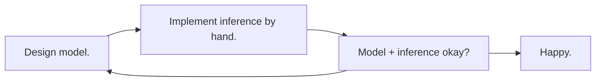
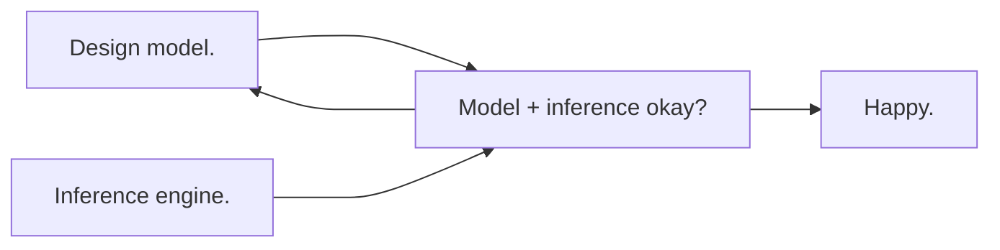
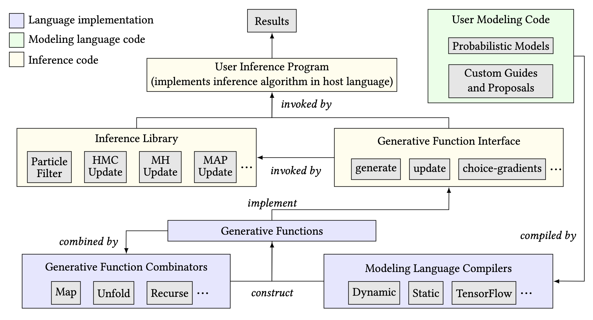

# Overview

**GenJAX: a probabilistic programming library designed from the ground up to scale Bayesian modeling and inference into high performance settings.** (1)
{ .annotate }

1.  Here, _high performance_ means massively parallel, either cores or devices.

    For those whom this overview page may be irrelevant: the value proposition is about putting expressive models and customizable Bayesian inference on GPUs, TPUs, etc - without sacrificing abstraction or modularity.

---

[**Gen**][gen] is a multi-paradigm (generative, differentiable, incremental) system for probabilistic programming. **GenJAX** is an implementation of Gen on top of [**JAX**][jax] (2) - exposing the ability to programmatically construct and manipulate **generative functions** (1) (computational objects which represent probability measures over structured sample spaces), with compilation to native devices, accelerators, and other parallel fabrics. 
{ .annotate }

1.  By design, generative functions expose a concise interface for expressing approximate and differentiable inference algorithms. 

    The set of generative functions is extensible! You can implement your own - allowing advanced users to performance optimize their critical modeling/inference code paths.

    You can (and we, at the [MIT Probabilistic Computing Project](http://probcomp.csail.mit.edu/), do!) use these objects for machine learning - including robotics, natural language processing, reasoning about agents, and modelling / creating systems which exhibit human-like reasoning.

    A precise mathematical formulation of generative functions is given in [Marco Cusumano-Towner's PhD thesis][marco_thesis].

2.  If the usage of JAX is not a dead giveaway, GenJAX is written in Python.

<div class="grid cards" markdown>

=== "Model code"
   
    <p align="center">
    Defining a beta-bernoulli process in GenJAX.
    </p>

    ```python
    @genjax.gen
    def model():
      p = Beta(0, 1) @ "p"
      v = Bernoulli(p) @ "v"
      return v
    ```


===   "Inference code"
    
    <p align="center">
    This works for **any** generative function, not just the beta-bernoulli model.
    </p>
    
    ```python
    # Sampling importance resampling.
    def sir(prng_key: PRNGKey, gen_fn: GenerativeFunction
            obs: ChoiceMap, args: Tuple, n_samples: Int):
        pass
    ```


</div>

## What sort of things do you use GenJAX for?

<div class="grid cards" markdown>

=== "Real time object tracking"
    Real time tracking of objects in 3D using probabilistic rendering. (Left) Ground truth, (center) depth mask, (right) inference overlaid on ground truth.

    <p align="center">
    
    </p>

</div>

## Why Gen?

GenJAX is a [Gen][gen] implementation. If you're considering using GenJAX - it's worth starting by understanding why Gen exists, and what problems it purports to solve.

### The evolution of probabilistic programming languages

Probabilistic modeling and inference is hard: understanding a domain well enough to construct a probabilistic model in the Bayesian paradigm is challenging, and that's half the battle - the other half is designing effective inference algorithms to probe the implications of the model (1).
{ .annotate }

1.  Some probabilistic programming languages restrict the set of allowable models, providing (in return) efficient (often, exact) inference. 

    Gen considers a wide class of models - include Bayesian nonparametrics, open-universe models, and models over rich structures (like programs!) - which don't natively support efficient exact inference.

In the past, probabilistic modellers typically considered the following design loop.



The first generation (1) of probabilistic programming systems introduced inference engines which could operate abstractly over many different models, without requiring the programmer to return and tweak their inference code. The utopia envisioned by these systems is shown below.
{ .annotate }

1.  Here, the definition of "first generation" includes systems like JAGS, BUGS, BLOG, IBAL, Church, Infer.NET, Figaro, Stan, amongst others.

    But more precisely, many systems preceded the [DARPA PPAML project][ppaml] - which gave rise to several novel systems, including the predecessors of Gen.



The problem with this utopia is that we often do need to program our inference algorithms (1) to achieve maximum performance, with respect to accuracy as well as runtime. First generation systems were not designed with this in mind.
{.annotate}

1.  Here, _programmable inference_ denotes using a custom proposal distribution in importance sampling, or a custom variational family for variational inference, or even a custom kernel in Markov chain Monte Carlo.

### Programmable inference

The goal then is to allow users to customize when required, while retaining the rapid model/inference iteration properties explored by first generation systems.

Gen addresses this goal by introducing a separation between modeling and inference code: **the generative function interface**.

<p align="center">

</p>

The interface provides an abstraction layer that inference algorithms can call to compute the right math (1). Advanced developers can create new model languages by implementing the interface - and immediately gain access to advanced inference procedures.
{ .annotate }

1.  Examples of hard-to-get-right math: importance weights, accept reject ratios, and gradient estimators. 

    For simple models and inference, one might painlessly derive these quantities. As soon as the model/inference gets complicated, however, you might find yourself thanking the interface.

## Whose using Gen?

Gen supports a growing list of users, with collaboration across academic research labs and industry affiliates.

<p align="center">

</p>

We're looking to expand our user base! If you're interested, [please contact us to get involved][probcomp_contact_form].

[gen]: https://www.gen.dev/
[gen.jl]: https://github.com/probcomp/Gen.jl
[genjax]: https://github.com/probcomp/genjax
[jax]: https://github.com/google/jax
[marco_thesis]: https://www.mct.dev/assets/mct-thesis.pdf
[ppaml]: https://www.darpa.mil/program/probabilistic-programming-for-advancing-machine-learning
[probcomp]: http://probcomp.csail.mit.edu/
[probcomp_contact_form]: https://docs.google.com/forms/d/e/1FAIpQLSfbPY5e0KMVEFg7tjVUsOsKy5tWV9Moml3dPkDPXvP8-TSMNA/viewform?usp=sf_link
