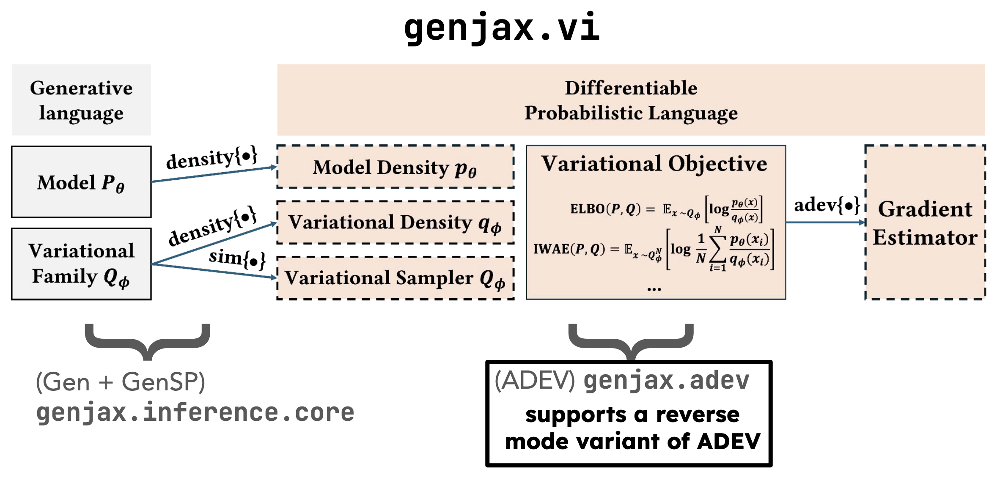

# Inference

Conditioning probability distributions is a commonly desired operation, allowing users to express Bayesian inference problems. Conditioning is also a subroutine in other desired operations, like marginalization.

## The language of inference

In GenJAX, inference problems are specified by constructing [`Target`][genjax.inference.Target] distributions. Their solutions are approximated using [`Algorithm`][genjax.inference.Algorithm] families.

::: genjax.inference.Target
    options:
        show_root_heading: true

Algorithms inherit from a class called [`SampleDistribution`][genjax.inference.SampleDistribution] - these are objects which implement the _stochastic probability interface_ [[Lew23](https://dl.acm.org/doi/abs/10.1145/3591290)], meaning they expose methods to produce samples and samples from _density estimators_ for density computations.

::: genjax.inference.SampleDistribution
    options:
        show_root_heading: true
        members:
          - random_weighted
          - estimate_logpdf

`Algorithm` families implement the stochastic probability interface. Their [`Distribution`][genjax.Distribution] methods accept `Target` instances, and produce samples and density estimates for approximate posteriors.

::: genjax.inference.Algorithm
    options:
        show_root_heading: true
        members:
          - random_weighted
          - estimate_logpdf

By virtue of the _stochastic probability interface_, GenJAX also exposes _marginalization_ as a first class concept.

::: genjax.inference.Marginal
    options:
        show_root_heading: true
        members:
          - random_weighted
          - estimate_logpdf

## The SMC inference library

Sequential Monte Carlo (SMC) is a popular algorithm for performing approximate inference in probabilistic models.

::: genjax.inference.smc.SMCAlgorithm
    options:
        show_root_heading: true

::: genjax.inference.smc.Importance
    options:
        show_root_heading: true

::: genjax.inference.smc.ImportanceK
    options:
        show_root_heading: true

## The VI inference library

<figure markdown="span">
  { width = "300" }
  <figcaption><b>Fig. 1</b>: How variational inference works in GenJAX.</figcaption>
</figure>

::: genjax.inference.vi.adev_distribution
    options:
        show_root_heading: true

::: genjax.inference.vi.ELBO
    options:
        show_root_heading: true

::: genjax.inference.vi.IWELBO
    options:
        show_root_heading: true

::: genjax.inference.vi.PWake
    options:
        show_root_heading: true

::: genjax.inference.vi.QWake
    options:
        show_root_heading: true
